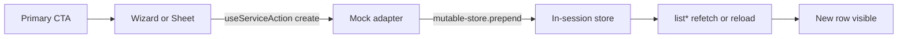

# Rantai Lake — UX End-to-End Flows

Dokumentasi alur interaksi pengguna untuk create, inspect, dan operational actions di console. Semua alur berjalan terhadap **mock services** (in-session). Data create hilang setelah full page reload.

Status: verified against repository code (create wizards, CreateSheet, detail ops).

---

## 1. Pola UX bersama

### 1.1 Anatomi halaman list

```text
PageHeader (title + description + primary action)
FilterToolbar (search / filters)
LoadingSkeleton | ErrorState | EmptyState(+CTA) | DataTable
DetailDrawer (opsional, inspect cepat)
```

| Pola | Kapan dipakai |
|---|---|
| **Step wizard** (`FormStepLayout`) | Entity kompleks — pipeline, connector, policy, streaming job, workflow |
| **CreateSheet** | Entity sederhana — project, knowledge source, admin invite, rules |
| **ConfirmActionDialog** | Pause / Suspend / Revoke dan aksi berisiko |
| **Detail route** | Entity durable (pipeline, streaming, employee, asset) |
| **DetailDrawer** | Inspect cepat dari list (connector, policy, workflow, dll.) |

### 1.2 Persistensi mock



- Wizard create: `router.push` ke list → `useService` memuat ulang.
- Sheet create: `state.reload()` di halaman yang sama.
- Ops (pause/run): `state.reload()` di detail.

---

## 2. Build — Pipelines

### 2.1 Create Pipeline (wizard)

| Step | Field wajib |
|---|---|
| Source | name, kind, source zone/table, incremental column |
| Transform | ≥1 transform chip **atau** FBIC on |
| Target | target zone/table |
| Schedule | schedule text |
| Review | ringkasan read-only → **Create pipeline** |

```text
/pipelines → Create Pipeline → /pipelines/create
  → isi langkah (Next disabled sampai valid)
  → Review → Create pipeline
  → redirect /pipelines (baris draft baru di atas)
```

**Cancel:** header Cancel → `/pipelines` (tanpa dirty-state warning).

### 2.2 Agentic Builder (dialog)

```text
/pipelines → Agentic Builder
  → model + instruction (wajib) + database + file opsional
  → Generate (fase loading mock)
  → dialog tutup, list reload, pipeline draft muncul
```

### 2.3 Detail ops

```text
/pipelines/{id}
  → Run now          → status running + run history refresh
  → Pause (confirm)  → status paused; tombol jadi Resume
  → Resume           → status ready
```

---

## 3. Build — Streaming Jobs

### 3.1 Create

```text
/streaming → Create Streaming Job → /streaming/create
  Basics → Sources → Definition SQL → Triggers → Review
  → Create job → /streaming
```

### 3.2 Detail ops

```text
/streaming/{id}
  → Pause (confirm + impact) → paused
  → Resume → running
```

Ini pola pause/resume paling lengkap di produk.

---

## 4. Data — Connectors

```text
/connectors → New Connector → /connectors/create
  Type → Connection → Test (harus pass) → Discover → Scope → Review
  → Create connector → /connectors
  → klik baris → DetailDrawer (inspect)
```

Secret hanya sebagai **reference path** (mis. `vault://…`), bukan nilai rahasia di browser.

---

## 5. Governance — Policies

```text
/governance/policies → Create Policy → /governance/policies/create
  Basics → Scope → Rules → Impact preview → Review
  → opsional Activate on create
  → Create draft | Create & activate → /governance/policies
```

Sheet creates terkait (bukan wizard penuh):

| Halaman | CTA | Service |
|---|---|---|
| Classification | Add Rule | `createClassificationRule` |
| Data Quality | Add Quality Rule | `createQualityRule` |
| Residency | Create Residency Rule | `createResidencyRule` |

---

## 6. Intelligence — Agent Workflows

```text
/agents/workflows → Create Workflow → /agents/workflows/create
  Trigger → Steps (chips + FlowCanvas preview) → Approval gate → Review
  → Create workflow → /agents/workflows
```

Catatan: bukan visual node editor penuh; step kinds + preview.

---

## 7. CreateSheet (pola sederhana)

Contoh kanonik — **Collaboration → Create Project**:

```text
/query-studio/collaboration → Create Project (sheet)
  → name + collaborators (comma-separated, chip preview)
  → Create → sheet tutup, list reload, project baru muncul
```

Sheet creates lain (field berbeda, pola sama):

| Halaman | CTA |
|---|---|
| Knowledge | Add Source |
| Vector Jobs | New Vector Job |
| Digital Employees | Create Employee |
| Tool Registry | Register Tool |
| Storage | Create Lifecycle Policy |
| Admin Users | Invite User |
| Admin Roles | Create Role |
| Admin Tenants | Create Tenant |
| Admin Service Identities | Create Service Identity |

---

## 8. Intelligence — Digital Employee ops

```text
/agents/employees → Create Employee (sheet) → muncul di list
/agents/employees/{id}
  → Suspend (confirm) → paused → Resume
  → Revoke (confirm, destructive) → cancelled (tidak bisa di-resume)
```

---

## 9. Operational pages (tanpa create entity)

| Halaman | Actions |
|---|---|
| Alerts | Acknowledge / Resolve di drawer |
| Workloads | Cancel queued/running |
| Query Studio | Run NL/SQL, Saved, History |
| Semantic Search | Search |

Overview, Activity, Audit, Lineage, Observability, Services, Usage, Catalog, Data Explorer: fokus/inspect — tidak ada invent-create.

---

## 10. Checklist smoke test (manual)

Gunakan dengan `npm run dev` (mock only):

1. **Pipelines:** Create wizard → list → detail → Run now → open run drawer → cancel/retry when applicable → Pause → Resume → follow Target → asset.
2. **Agentic Builder:** generate dari list → baris baru muncul.
3. **Connectors:** wizard → list → drawer → Test connection → Create pipeline → dependent links.
4. **Streaming:** create → detail Pause/Resume → Triggers link ke agent/workflow → sink asset.
5. **Policies:** create draft → list status draft → asset Policies tab links back.
6. **Workflows:** create dengan approval gate → list.
7. **Approvals:** `/agents/approvals` → open pending → Approve/Reject + comment → Audit link.
8. **Query Studio:** federated SQL → estimate plan → Run → Results plan + View in Audit → History Audit.
9. **Knowledge:** source drawer → Vector Jobs / Semantic Search / Catalog asset.
10. **Storage:** Restore to Hot → operation appears; tier vs layer copy clear.
11. **Collaboration:** Create Project sheet → list tanpa pindah route.
12. **Employee:** Suspend → Resume → Revoke; Approvals/Audit links on runs.

---

## 11. Batasan UX yang masih diketahui

| Gap | Severity | Catatan |
|---|---|---|
| Tidak ada dirty-state warning saat Cancel wizard/sheet | Medium | Form terisi hilang tanpa konfirmasi |
| Observability explorer | Deferred | Hanya SLO board |
| Collaboration project detail route | Deferred | List + drawer/sheet saja |
| Visual workflow node editor penuh | Out of scope | Step chips + FlowCanvas preview |
| Real backend persistence | N/A | Mock in-session only |

---

## 12. File referensi implementasi

| Concern | Lokasi |
|---|---|
| Step wizard shell | `src/components/patterns/form-step-layout.tsx` |
| Review summary | `src/components/patterns/form-review-summary.tsx` |
| Create sheet | `src/components/patterns/create-sheet.tsx` |
| Confirm dialog | `src/components/patterns/confirm-action-dialog.tsx` |
| Mutable mock store | `src/services/mock/mutable-store.ts` |
| Feature coverage matrix | `docs/FEATURE_COVERAGE.md` |
| Repository validation | `docs/RANTAI_LAKE_REPOSITORY_VALIDATION.md` |
